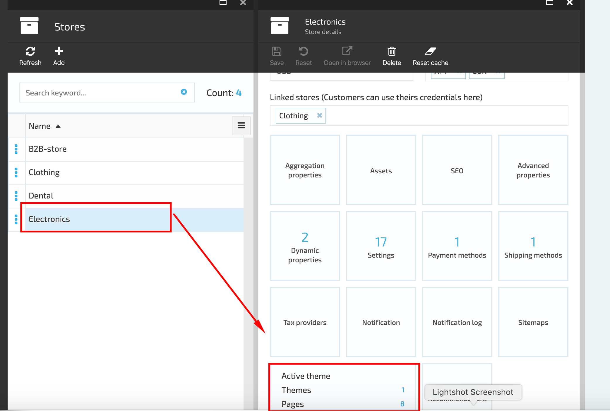
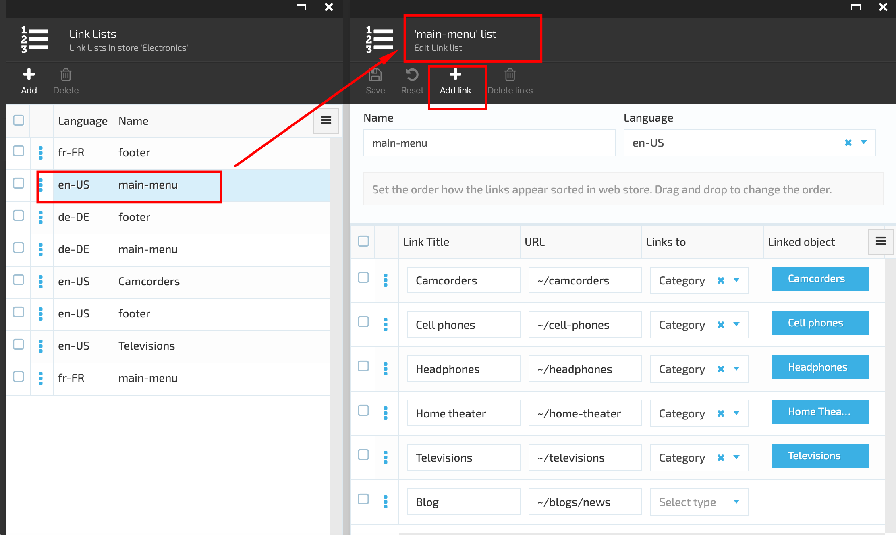

# Overview

VirtoCommerce.Content module is a  Content Management System. The Content Module structure consists of Stores and related widgets :

1. Theme;
1. Pages;
1. Link lists;
1. Blogs.

## Key features

1. Themes Management on UI;
1. Pages and blogs management on UI;
1. Link lists management;
1. Manage documents in markdown format.

The VC Content module can be accessed both ways: directly and via Stores module.

To access the VC Content directly you should navigate to More->Content Module

To access the VC Content Module via Stores module, you should navigate to More->Stores->Store name-> Content module widget

## Feature Description

### Virto Commerce Theme

Virtocommerce Theme is a frontend application for your ecommerce websites.
The default Theme is included into the VC Content Module and provided out of the box. The default theme consists of the following folders:

1. Assets;
1. Config;
1. Layouts;
1. Locales;
1. Snippets;
1. Social;
1. Templates.

Each folder contains files that define the Storefront UI.
The theme structure should be predefined in advance and is created by a developer.

VirtoCommenrce Content Module allows adding as many themes as necessary. There is also a possibility to set an active theme, that will be displayed on Storefront.

How to add and activate Theme in Store described in the [Theme Management](theme-management.md) article.

### Pages and Blogs

Blogs in Virtocommerce are used to update the Blog content (news and articles) on the Storefront.

On Storefront the Blog contains static pages, like 'About us', 'Search', 'Terms & Conditions', 'Contact us' that also can be edited in Virtocommerce Content module.

 The content is downloaded from the remote location at runtime and is saved in the local website folder structure under App_Data folder from where local runtime generator picks it up and renders as html.

How to edit Pages and blogs in Store is described in the [Pages and Blogs Management](pages-blogs-management.md) article

### Link lists

The Link lists contain links to all pages in Store and show how links to different pages appear sorted in web store.

To view the link lists related to a specific Store, the admin should select the Store and click on the 'Link lists' widget. The system will open the 'Link lists' blade.

The list contains all the links displayed on Storefront, example 'Footer', 'Main menu', etc. The admin can add additional links that will be displayed on the Storefront and edit the existing ones.

The Main menu and Footer are hard-coded. Any other links can be added by the admin, but they should relate to one of the hard coded link.

The system allows to create a specific Main menu for each language.

## Settings

**VirtoCommerce.Content.CmsContentConnectionString** - CMS content connection string. Defines the provider and connection parameters to connect to content assets (themes, pages, etc.). In fact, it's Platform's <a href="https://virtocommerce.com/docs/vc2devguide/deployment/platform-settings" target="_blank">AssetsConnectionString</a> preconfigured for CMS.

## Available resources

* Module related service implementations as a <a href="https://www.nuget.org/packages/VirtoCommerce.ContentModule.Data" target="_blank">NuGet package</a>
* API client as a <a href="https://www.nuget.org/packages/VirtoCommerce.ContentModule.Client" target="_blank">NuGet package</a>
