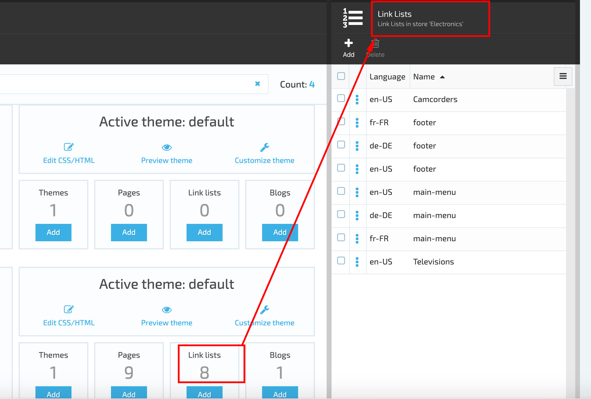

# Pages and Blogs Management

## Pages

Pages displayed on the Storefront can be managed in VC Content Module. The admin should select the Store and then click on 'Pages'. The system will display the 'Pages list' blade and allow the admin to mange each page from the list. The following actions are allowed by the system:

1. Download the file that contains page content;
1. Copy link;
1. Rename the page name;
1. Delete the file that contains the page content;
1. Upload new file;
1. Add new file;
1. Create new folder.

Managing the pages on admin side will result in changing the content and view on the Storefront.

### Edit Page

To edit the page, the admin should select a page from the list and click on it. The system will open the 'Edit Page' blade.

### Markdown tab

The Markdown tab consists of the Markdown subtab and Preview. Here you can add and edit the Page text.

### Metadata tab

Here you can edit the page settings

## Link Lists

To view the link lists related to a specific Store, the admin should select the Store and click on the 'Link lists' widget. The system will open the 'Link lists' blade.

The list contains all the links displayed on Storefront, example 'Footer', 'Main menu', etc. The admin can add additional links which will be displayed on the Storefront and edit the existing ones.

The Main menu and Footer are hard-coded. Any other links can be added by the admin, but they should relate to one of the hard coded link.

The system allows to create a specific Main menu for each language.

## Blogs

