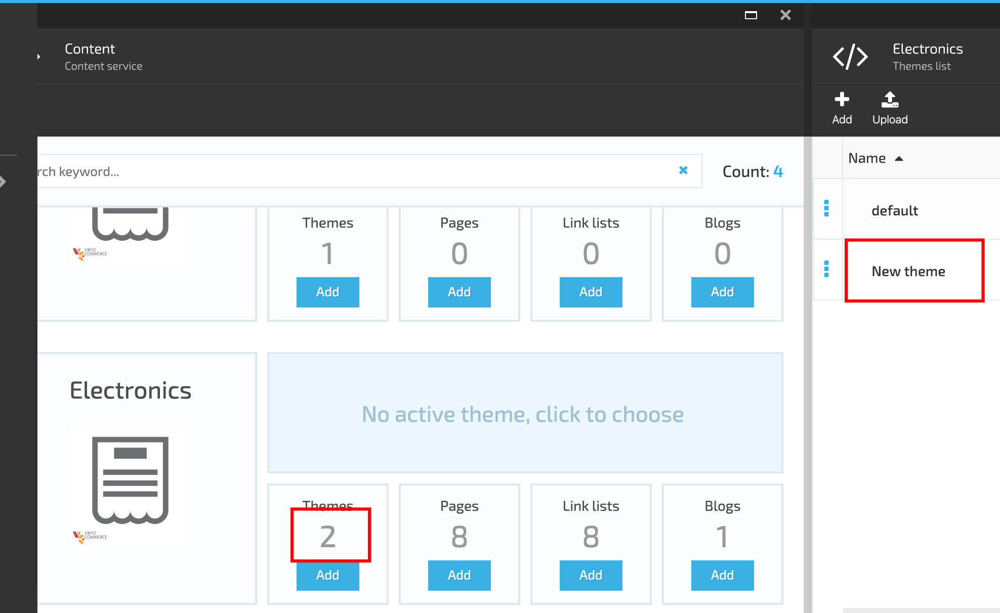

# Theme Management

Virtocommerce Theme is a frontend application for your ecommerce websites.
The default Theme is included into the VC Content Module and provided out of the box. The default theme consists of the following folders:

1. Assets;
1. Config;
1. Layouts;
1. Locales;
1. Snippets;
1. Social;
1. Templates.

Each folder contains files that define the Storefront UI.
The theme structure should be predefined in advance and is created by a developer.

VirtoCommenrce Content Module allows adding as many themes as necessary. There is also a possibility to set an active theme, that will be displayed on Storefront.

## Add New Theme

In order to add a new theme, the admin should select the store and click on the 'Add' button under the 'Themes'. On the 'New theme' blade the admin should enter the Name of the new theme into the 'Theme name' filed and click the 'Create' button. The system will create the new theme and display it on the list of themes.

A new theme can also be added using the 'Add' button on the 'Themes list'

### Upload New Theme

The system also allows add a new theme by uploading a theme zip file on 'Upload theme' blade. In order to upload the zip file, the admin should click the 'Upload' button on 'Themes list' blade and then simply drag and drop or browse the zip file on the opened 'Theme upload' blade

Once the zip file is uploaded, it will be unzipped and added to the Themes list.

If a new theme was created by the developer,it can be uploaded into a new environment using a zip file.

### Theme activation

The new theme can be activated. In order to activate the theme, the admin should select a theme on the 'Theme list' and open the menu under the three dots placed on the left side of the theme name. In the menu he should select the 'Set active in store' option.

## Manage Theme Assets

The Theme assets blade contains folders and files that can be managed. The admin can add new folders and files, delete the existing ones and rename them. The system also allows the admin to upload new folders and files and download the existing documents.

### Theme Assets

### Manage folders

### Manage documents

